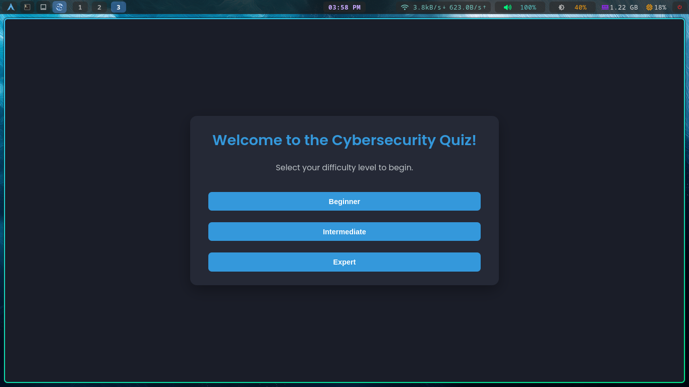
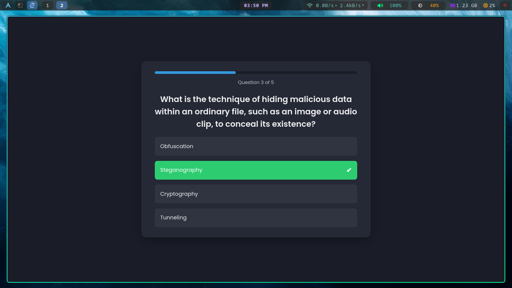
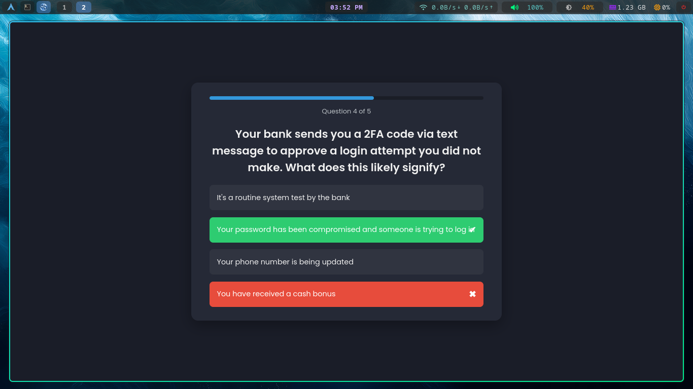
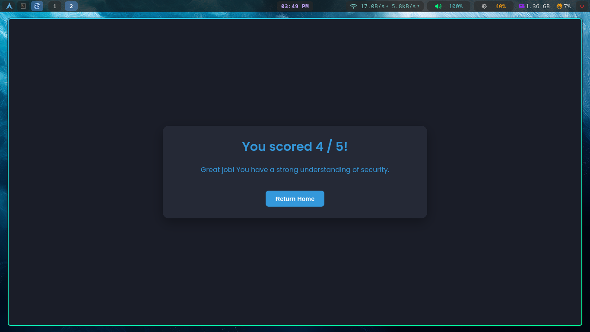

# Cybersecurity Quiz App

<h5 align="center"> Live link : <a href="https://sumanxhub.github.io/Cybersecurity-Quiz-App/"><ins>sumanxhub.github.io/Cybersecurity-Quiz-App</ins></a> </h5>

<div align="center"> 
    
    
    
    
</div>

<div align="center"> 
    An interactive, scenario-based web application designed to test and improve your knowledge of cybersecurity concepts in a fun and engaging way.
</div>


## Preview

<h5 align="center"> <u>Home Screen</u> </h5>
 <br>

<h5 align="center"> <u>Quiz Screen</u> </h5>
 <br>
 <br>

<h5 align="center"> <u>Result Screen</u> </h5>
 <br>


## Features

  - **Difficulty Modes**: Select Beginner, Intermediate, or Pro to match your skill level.
  - **Dynamic Questions**: Randomly selects 5 questions from a JSON-based question bank, tailored to your chosen difficulty.
  - **Instant Feedback**: Options highlight as ✔ correct or ✖ incorrect with vibrant colors and icons.
  - **Auto-Progression**: Automatically moves to the next question after a brief delay, creating a smooth user flow.
  - **Modern Design**: Fully responsive, dark-themed interface optimized for all devices.
  - **Visual Progress Bar**: Tracks your quiz progress with a sleek, animated bar.
  - **Dynamic Score Feedback**: Personalized messages and a detailed score summary at the end.


## Local Setup

To run this project locally, follow these simple steps:
 * Clone the repository:

   ```sh
    git clone https://github.com/your-github-username/your-repo-name.git
   ```

 * Navigate to the project directory:
   ```sh
    cd your-repo-name
   ```

 * Open index.html in your favorite web browser.
   * No complex setup or dependencies are required!

## License

This project is licensed under the [MIT License](LICENSE.txt).

